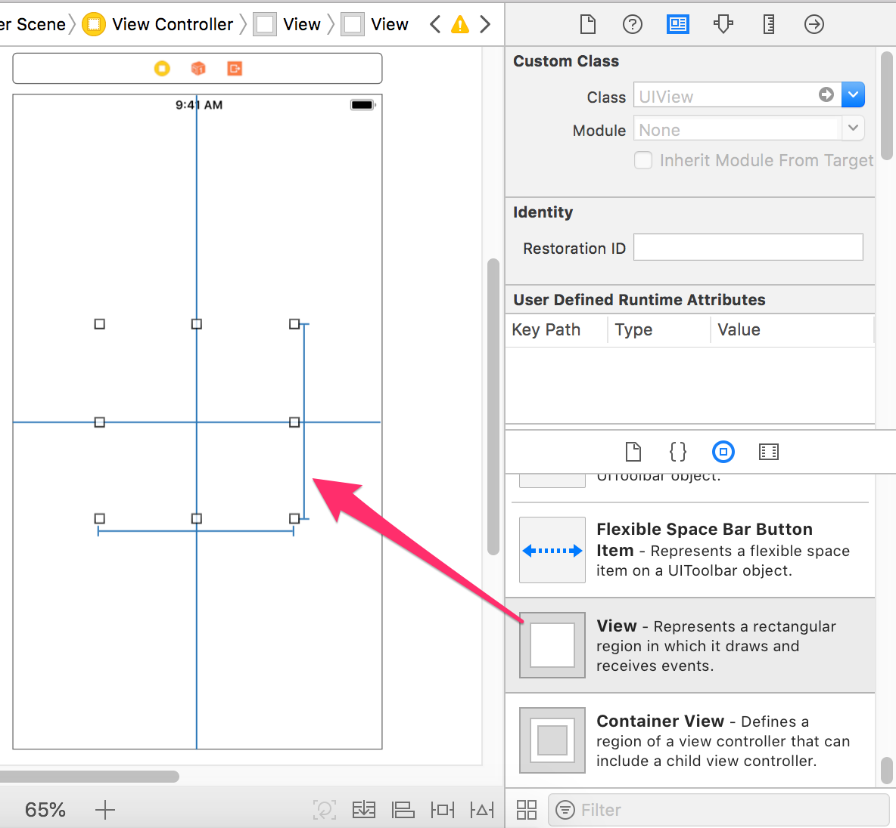
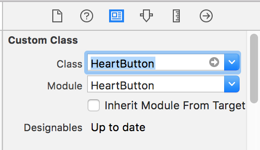
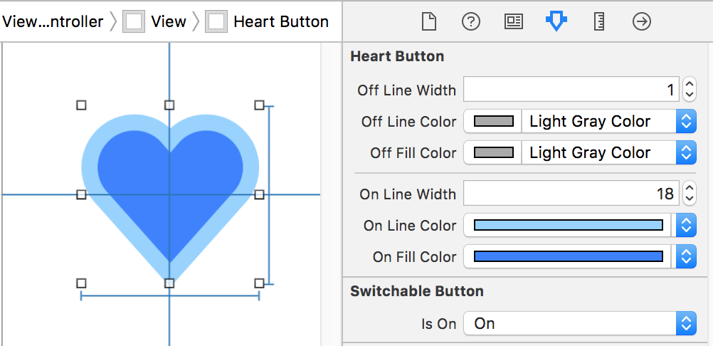

# ♥️ Heart Button ♥️

[](https://travis-ci.org/darquro/heart-button)
[](https://cocoapods.org/pods/HeartButton)
[](https://cocoapods.org/pods/HeartButton)
[](https://cocoapods.org/pods/HeartButton)

Animating Heart button, that was inspired by Heart animation within [Instagram App](https://itunes.apple.com/app/instagram/id389801252).


## Usage

1. Drag and drop UIView.

   

2. Set `HeartButton` to Class and Module fields.

   

3. Set the outlet and write the handling code.

    ```swift
    import HeartButton

    class ViewController: UIViewController {

        @IBOutlet weak var heartButton: HeartButton!
        
        override func viewDidLoad() {
            super.viewDidLoad()
            
            self.heartButton.stateChanged = { sender, isOn in
                if isOn {
                    // selected
                } else {
                    // unselected
                }
            }
        }
    ```

## Customizing

You can change the design on the Storyboard.



Or You can change it programmatically.

| property | type | default |
|----|----|----|
| offLineWidth | CGFloat | 2.0 |
| offLineColor | UIColor | UIColor.black |
| offFillColor | UIColor | UIColor.clear |
| onLineWidth  | CGFloat | 0 |
| onLineColor  | UIColor | UIColor.clear |
| onFillColor  | UIColor | UIColor(red:0.92, green:0.29, blue:0.35, alpha:1.0) |

## Change state programmatically

```swift
// Change with animation
self.heartButton.setOn(!self.heartButton.isOn, animated: true)
```

## Installation

HeartButton is available through [CocoaPods](http://cocoapods.org). To install
it, simply add the following line to your Podfile:

```ruby
pod "HeartButton"
```

To integrate using [Carthage](https://github.com/Carthage/Carthage), add the following to your Cartfile:

```
github "darquro/heart-button"
```

## Requirements

- Swift 4.0 or later
- iOS 9.0 or later

## Author

darquro

## License

HeartButton is available under the MIT license. See the LICENSE file for more info.
